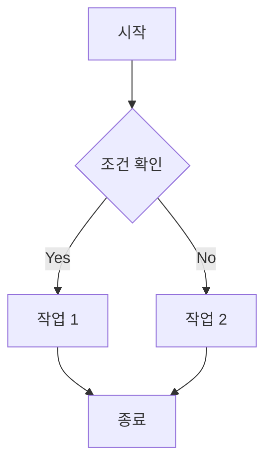
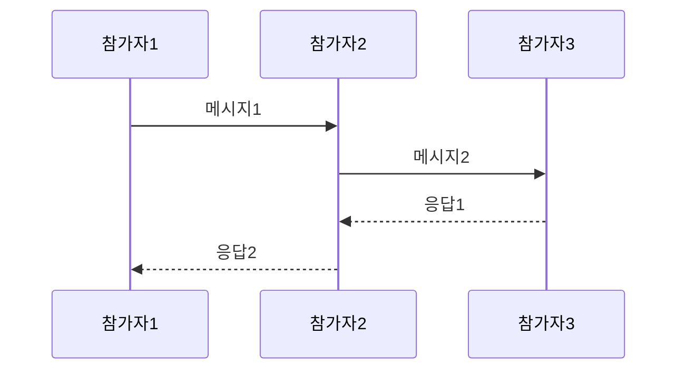
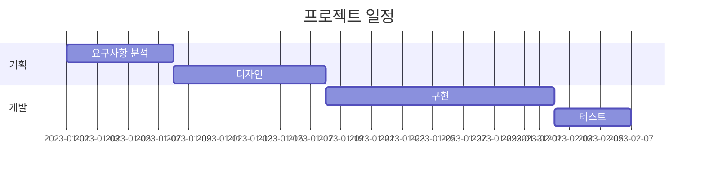

# 옵시디언 고급 사용자를 위한 팁과 트릭

옵시디언을 기본적인 수준에서 사용해본 후, 더 깊이 파고들고 싶다면 이 글에서 소개하는 고급 팁과 트릭을 활용해보세요. 이 글에서는 기본 기능을 넘어서 옵시디언을 최대한 활용할 수 있는 고급 테크닉을 소개합니다. 옵시디언의 기본 사용법은 [[01_옵시디언_입문과_활용_가이드]]에서 확인할 수 있습니다.

## CSS 스니펫을 활용한 인터페이스 커스터마이징

옵시디언의 외관은 CSS 스니펫을 통해 완전히 새롭게 바꿀 수 있습니다. 테마 적용만으로는 아쉬운 부분을 직접 수정해보세요.

### CSS 스니펫 추가 방법

1. 설정 > 외관 > CSS 스니펫 섹션으로 이동
2. 폴더 아이콘을 클릭하여 스니펫 폴더 열기
3. 새 `.css` 파일 생성
4. 스니펫 토글 스위치를 켜서 활성화

CSS 스니펫은 [[03_옵시디언_플러그인_완전_정복]]에서도 간략히 소개한 바 있습니다.

### 유용한 CSS 커스터마이징 예시

#### 1. 노트 너비 조정
```css
.markdown-source-view.mod-cm6 .cm-line,
.markdown-preview-view.is-readable-line-width .markdown-preview-section {
  max-width: 900px !important;
}
```

#### 2. 글꼴 크기 및 스타일 변경
```css
body {
  --font-text-size: 16px;
  --font-text: 'Pretendard', -apple-system, BlinkMacSystemFont, sans-serif;
  --font-monospace: 'JetBrains Mono', monospace;
}

.cm-s-obsidian, .markdown-preview-view {
  font-family: var(--font-text);
  font-size: var(--font-text-size);
  line-height: 1.6;
}

.cm-s-obsidian .cm-header, .markdown-preview-view h1, 
.markdown-preview-view h2, .markdown-preview-view h3,
.markdown-preview-view h4, .markdown-preview-view h5, 
.markdown-preview-view h6 {
  font-family: var(--font-text);
  font-weight: 700;
}
```

#### 3. 링크 스타일 커스터마이징
```css
.internal-link {
  text-decoration: none;
  background-color: rgba(14, 110, 184, 0.05);
  border-bottom: 1px solid rgba(14, 110, 184, 0.2);
  padding: 0 2px;
  border-radius: 3px;
  transition: all 0.2s ease;
}

.internal-link:hover {
  background-color: rgba(14, 110, 184, 0.1);
  border-bottom: 1px solid rgba(14, 110, 184, 0.4);
}
```

내부 링크 스타일을 커스터마이징하면 [[02_옵시디언으로_나만의_나무위키_만들기]]에서 설명하는 위키 스타일 지식 베이스를 더 직관적으로 탐색할 수 있습니다.

#### 4. 고급 표 스타일링
```css
table {
  border-collapse: collapse;
  width: 100%;
  margin: 20px 0;
}

th {
  background-color: var(--background-secondary);
  padding: 10px;
  border: 1px solid var(--background-modifier-border);
  font-weight: 600;
}

td {
  padding: 8px;
  border: 1px solid var(--background-modifier-border);
}

tr:nth-child(even) {
  background-color: var(--background-secondary-alt);
}
```

#### 5. 콜아웃 박스 디자인 개선
```css
.callout {
  border-radius: 8px;
  border-width: 0;
  border-left-width: 4px;
  padding: 16px;
  margin: 20px 0;
}

.callout-title {
  font-weight: 600;
  margin-bottom: 8px;
  display: flex;
  align-items: center;
}

.callout-icon {
  margin-right: 8px;
}

.callout[data-callout="tip"] {
  background-color: rgba(0, 140, 255, 0.1);
  border-color: rgb(0, 140, 255);
}

.callout[data-callout="warning"] {
  background-color: rgba(255, 153, 0, 0.1);
  border-color: rgb(255, 153, 0);
}
```

### 고급 CSS 팁

- **[CSS 변수 활용](https://forum.obsidian.md/t/obsidian-css-variables-with-examples/16473)**: 자주 사용하는 값을 변수로 정의하여 일관성 있는 스타일 적용
- **[미디어 쿼리](https://developer.mozilla.org/ko/docs/Web/CSS/Media_Queries)**: 화면 크기에 따라 다른 스타일 적용
- **[Obsidian Hub](https://publish.obsidian.md/hub/04+-+Guides%2C+Workflows%2C+%26+Courses/for+Theme+Designers)**: 테마 디자이너를 위한 가이드 참고

## 템플릿과 Templater 플러그인 활용 극대화

Templater 플러그인은 기본 템플릿 기능보다 훨씬 강력한 동적 템플릿을 만들 수 있게 해줍니다. 이 플러그인에 대한 기본 소개는 [[03_옵시디언_플러그인_완전_정복]]에서 찾아볼 수 있으며, [[04_옵시디언으로_제텔카스텐_시스템_구현하기]]에서는 제텔카스텐 ID 자동화에 활용하는 방법을 설명합니다.

### Templater 기본 구문 정리

| 구문 | 설명 | 예시 |
|------|------|------|
| `<%` `%>` | 기본 코드 블록 | `<% tp.file.title %>` |
| `<%=` `%>` | 값을 즉시 출력 | `<%= tp.date.now() %>` |
| `<%-` `%>` | HTML 이스케이프 없이 출력 | `<%- "<strong>굵게</strong>" %>` |

### 유용한 Templater 스크립트 예시

#### 1. 고급 파일명 처리
```javascript
<%*
// 대시를 공백으로 변환하고 적절한 대소문자로 변환
const fileName = tp.file.title
  .replace(/-/g, ' ')
  .replace(/\b\w/g, char => char.toUpperCase());
tR += "# " + fileName;
%>
```

#### 2. 동적 YAML 프론트매터 생성
```javascript
<%*
// 사용자 상호작용으로 태그 선택
const tags = await tp.system.suggester(
  ["선택하세요", "프로젝트", "아이디어", "회의", "학습", "개인"],
  ["", "project", "idea", "meeting", "learning", "personal"]
);

// 상태 선택
const status = await tp.system.suggester(
  ["진행 중", "계획", "완료", "보류"],
  ["in-progress", "planned", "completed", "on-hold"]
);
-%>
---
created: <% tp.file.creation_date("YYYY-MM-DD HH:mm") %>
tags: <% tags %>
status: <% status %>
---
```

#### 3. 조건부 템플릿 콘텐츠
```javascript
<%*
const type = await tp.system.suggester(
  ["프로젝트 노트", "회의록", "참고 자료"],
  ["project", "meeting", "reference"]
);

if (type === "project") { %>
# 프로젝트: <% tp.file.title %>

## 목표
- 

## 작업 항목
- [ ] 

## 마일스톤
- [ ] 
<% } else if (type === "meeting") { %>
# 회의록: <% tp.file.title %>

## 참석자
- 

## 논의 사항
- 

## 결정 사항
- 

## 후속 조치
- [ ] 
<% } else if (type === "reference") { %>
# 참고 자료: <% tp.file.title %>

## 개요
- 

## 핵심 내용
- 

## 인사이트
- 

## 출처
- 
<% } %>

작성일: <% tp.file.creation_date("YYYY-MM-DD") %>
```

### 고급 템플릿 워크플로우 자동화

#### 1. 일일 노트 자동화
```javascript
<%*
// 오늘 날짜 형식 지정
const today = tp.date.now("YYYY-MM-DD");
const yesterday = tp.date.yesterday("YYYY-MM-DD");
const tomorrow = tp.date.tomorrow("YYYY-MM-DD");
-%>
# <% today %> 일일 노트

## 연결된 날짜
- 이전: [[<% yesterday %>]]
- 다음: [[<% tomorrow %>]]

## 오늘의 목표
- [ ] 

## 할 일
- [ ] 

## 메모 및 생각
- 

## 오늘의 회고
- 

## 내일을 위한 준비
- [ ] 
```

#### 2. 프로젝트 자동화 템플릿
```javascript
<%*
// 프로젝트 정보 수집
const projectName = await tp.system.prompt("프로젝트 이름");
const projectDesc = await tp.system.prompt("프로젝트 설명");
const startDate = tp.date.now("YYYY-MM-DD");
const targetDate = await tp.system.prompt("목표 완료일 (YYYY-MM-DD)");

// 프로젝트 매니저 선택
const manager = await tp.system.suggester(
  ["홍길동", "김철수", "이영희"],
  ["Hong", "Kim", "Lee"]
);
-%>
---
project_name: "<% projectName %>"
start_date: <% startDate %>
target_date: <% targetDate %>
status: "시작됨"
manager: "<% manager %>"
tags: [프로젝트]
---

# <% projectName %>

## 프로젝트 개요
<% projectDesc %>

## 목표
- 

## 주요 마일스톤
- [ ] 요구사항 분석 (~ )
- [ ] 설계 (~ )
- [ ] 개발 (~ )
- [ ] 테스트 (~ )
- [ ] 배포 (~ )

## 팀 구성
- <% manager %> (PM)
- 

## 관련 문서
- [[<% projectName %> 요구사항]]
- [[<% projectName %> 회의록]]
- [[<% projectName %> 이슈 트래킹]]

## 진행 상황
```dataview
LIST
FROM [[]]
WHERE contains(file.name, "<% projectName %>") AND contains(tags, "회의")
SORT file.cday DESC
```
```

## Dataview를 활용한 지식 베이스 관계 시각화

Dataview 플러그인을 사용하면 보관소 내 노트 간의 다양한 관계를 동적으로 시각화할 수 있습니다. [[03_옵시디언_플러그인_완전_정복]]에서 기초를 다뤘다면, 여기서는 더 고급 쿼리를 살펴보겠습니다.

### 강력한 Dataview 쿼리 예시

#### 1. 문서 간 연결 관계 시각화
```dataview
TABLE length(file.outlinks) AS "외부 링크 수", length(file.inlinks) AS "내부 링크 수"
FROM "프로젝트"
SORT length(file.inlinks) DESC
LIMIT 10
```

#### 2. 작업 진행 상황 자동 추적
```dataview
TABLE 
  choice(completed, "✅", "❌") AS "상태",
  due AS "기한",
  join(list(deadline - date(today))) + " 일 남음" AS "남은 기간"
FROM #과제 
WHERE contains(status, "진행중")
SORT deadline ASC
```

#### 3. 작성자별 문서 분석
```dataview
TABLE
  count() AS "문서 수",
  sum(length(file.outlinks)) AS "링크 수",
  join(sort(unique(flatten(tags)))) AS "사용된 태그"
FROM "팀 문서"
GROUP BY author
SORT count() DESC
```

#### 4. 지식 영역 연결 관계
```dataview
TABLE WITHOUT ID
  link(file.link, aliases[0] ? aliases[0] : file.name) AS "주제",
  map(file.outlinks, (x) => x.alias ? x.alias : x.path) AS "연결된 개념"
FROM #개념
WHERE length(file.outlinks) > 3
SORT length(file.outlinks) DESC
```

### Dataview JavaScript 활용

더 복잡한 데이터 처리와 시각화가 필요할 때는 Dataview JavaScript (DVSJ)를 사용할 수 있습니다.

```javascript
const projects = dv.pages('#프로젝트').where(p => p.status != "완료");
const now = dv.date("today");

dv.table(["프로젝트", "진행률", "남은 일수", "상태"],
  projects.map(p => {
    const total = p.tasks ? p.tasks.length : 0;
    const completed = p.tasks ? p.tasks.filter(t => t.completed).length : 0;
    const progress = total > 0 ? Math.round((completed / total) * 100) : 0;
    const daysLeft = p.deadline ? Math.round((p.deadline - now) / (24 * 60 * 60 * 1000)) : null;
    
    return [
      p.file.link,
      `${progress}% (${completed}/${total})`,
      daysLeft ? daysLeft : "기한 미설정",
      p.status
    ];
  })
);
```

## 고급 검색 및 필터링 전략

옵시디언의 검색 기능은 매우 강력하지만, 잘 알려지지 않은 고급 검색 구문을 활용하면 더욱 정교한 결과를 얻을 수 있습니다.

### 검색 연산자 마스터하기

| 연산자 | 설명 | 예시 |
|------|------|------|
| `file:` | 파일 이름 검색 | `file:"회의록"` |
| `path:` | 파일 경로 검색 | `path:"프로젝트/개발"` |
| `tag:` | 태그 검색 | `tag:#중요` |
| `line:(...)` | 한 줄 내 검색 | `line:(회의 내용)` |
| `section:(...)` | 섹션 내 검색 | `section:(결론)` |
| `block:(...)` | 블록 내 검색 | `block:(중요 결정사항)` |

### 불리언 연산자 활용

| 연산자 | 설명 | 예시 |
|------|------|------|
| `OR` | 둘 중 하나 | `프로젝트 OR 회의` |
| `AND` | 모두 포함 | `회의 AND 결정` |
| `-` | 제외 | `-회의록` |
| `(...)` | 그룹화 | `(회의 OR 미팅) AND 결정` |

### 고급 검색 예시

#### 1. 특정 기간 내 작성된 회의록 찾기
```
path:"회의록" (file:2023-01 OR file:2023-02) -tag:#외부
```

#### 2. 결정되지 않은 항목 찾기
```
line:(결정 필요) OR section:(미결정 사항) OR tag:#요결정
```

#### 3. 특정 프로젝트 관련 문서 중 우선순위가 있는 항목 찾기
```
path:"프로젝트/Alpha" tag:#우선순위 -tag:#완료
```

## Obsidian URI를 활용한 고급 자동화

Obsidian URI 스킴을 사용하면 외부 애플리케이션에서 옵시디언으로 링크하거나, 특정 작업을 자동화할 수 있습니다.

### 기본 URI 형식
```
obsidian://action?param1=value1&param2=value2
```

### 유용한 URI 액션 예시

#### 1. 특정 노트 열기
```
obsidian://open?vault=내보관소&file=프로젝트%2F회의록
```

#### 2. 검색 실행
```
obsidian://search?vault=내보관소&query=tag%3A%23중요
```

#### 3. 새 노트 생성
```
obsidian://new?vault=내보관소&name=새노트&content=내용입니다
```

#### 4. 데일리 노트 열기
```
obsidian://daily-notes?vault=내보관소
```

### 외부 도구와의 통합

#### 1. Alfred/Raycast 워크플로우
```applescript
on run {input, parameters}
    set obsidianURI to "obsidian://open?vault=내보관소&file=" & urlencode(input)
    do shell script "open \"" & obsidianURI & "\""
end run

on urlencode(input)
    set encoded to ""
    repeat with char in characters of input
        set asciiNum to ASCII number of char
        if asciiNum is 32 then
            set encoded to encoded & "%20"
        else if (asciiNum ≥ 48 and asciiNum ≤ 57) or (asciiNum ≥ 65 and asciiNum ≤ 90) or (asciiNum ≥ 97 and asciiNum ≤ 122) then
            set encoded to encoded & char
        else
            set hexList to "0123456789ABCDEF"
            set quotient to asciiNum div 16
            set remainder to asciiNum mod 16
            set firstDigit to character (quotient + 1) of hexList
            set secondDigit to character (remainder + 1) of hexList
            set encoded to encoded & "%" & firstDigit & secondDigit
        end if
    end repeat
    return encoded
end urlencode
```

#### 2. iOS 단축어 통합
iOS 단축어에서 `URL 열기` 액션을 사용하여 옵시디언 URI를 호출할 수 있습니다:
```
obsidian://new?vault=내보관소&name={{단축어입력}}&content={{클립보드}}
```

#### 3. 브라우저 북마크렛
웹 페이지에서 선택한 텍스트를 옵시디언에 추가하는 북마크렛:
```javascript
javascript:(function(){
    var title = document.title;
    var selection = window.getSelection().toString();
    var url = document.URL;
    var content = "# " + title + "\n\nURL: " + url + "\n\n> " + selection;
    var encodedContent = encodeURIComponent(content);
    var encodedTitle = encodeURIComponent(title);
    window.open("obsidian://new?vault=내보관소&name=" + encodedTitle + "&content=" + encodedContent);
})();
```

## 다양한 플랫폼 간 워크플로우 최적화

옵시디언은 여러 플랫폼에서 사용할 수 있으며, 각 환경에 맞는 최적화 전략이 있습니다.

### 데스크톱 최적화

#### 1. 다중 창 활용
- 메인 창에서는 현재 작업 중인 노트 편집
- 사이드 창에서는 참조 자료 열람
- 팝아웃 창으로 항상 볼 필요가 있는 대시보드 분리

#### 2. 작업 공간 레이아웃 저장
```
명령어 팔레트 > 작업 공간 > 레이아웃 저장
```

#### 3. 단축키 최적화
자주 사용하는 명령어에 단축키 할당:
- 설정 > 단축키 > (명령어 검색) > 단축키 지정

#### 4. 분할 편집 활용
- `Ctrl/Cmd + 클릭`: 새 창으로 링크 열기
- `Alt + 클릭`: 세로 분할 창으로 링크 열기
- `Alt + Shift + 클릭`: 가로 분할 창으로 링크 열기

### 모바일 최적화

#### 1. 모바일용 미니멀 테마
- 화면 공간을 최대한 활용하는 테마 선택
- 폰트 크기 최적화

#### 2. 퀵 액션 설정
- 자주 사용하는 명령어를 모바일 툴바에 추가
- 설정 > 모바일 > 툴바 구성

#### 3. 음성 입력 활용
- 오디오 레코더 플러그인으로 음성 메모 추가
- 시스템 음성 입력 기능 활용

#### 4. 위젯 활용 (iOS/Android)
- 홈 화면 위젯에서 빠른 노트 작성
- 바로가기를 통한 일일 노트 열기

### 크로스 플랫폼 일관성 유지

옵시디언의 설정과 데이터를 여러 기기에서 일관되게 유지하는 방법은 [[06_옵시디언_동기화와_백업_완벽_가이드]]에서 자세히 다루고 있습니다.

## 고급 마크다운 기법과 확장 문법

옵시디언은 기본 마크다운 외에도 다양한 확장 문법을 지원합니다. [[옵시디언_소개]]에서 기본 문법을 소개했다면, 여기서는 더 고급 기술을 알아보겠습니다.

### 고급 테이블 작성법

#### 1. 셀 정렬 지정
```markdown
| 왼쪽 정렬 | 가운데 정렬 | 오른쪽 정렬 |
|:---------|:----------:|----------:|
| 항목1    | 항목2      | 항목3     |
```

#### 2. 테이블 내 마크다운 사용
```markdown
| 항목 | 설명 |
|------|------|
| **굵게** | 중요한 내용 |
| *기울임* | 강조 내용 |
| [`코드`](링크) | 코드 샘플 |
```

#### 3. 테이블 내 체크박스 사용
```markdown
| 작업 | 상태 | 담당자 |
|------|------|-------|
| 디자인 | [x] | 홍길동 |
| 개발 | [ ] | 김철수 |
| 테스트 | [ ] | 이영희 |
```

### 고급 수학 표기법 (MathJax)

#### 1. 인라인 수식
```markdown
이차방정식 $ax^2 + bx + c = 0$의 근은 $x = \frac{-b \pm \sqrt{b^2 - 4ac}}{2a}$ 입니다.
```

#### 2. 블록 수식
```markdown
다음은 오일러 항등식입니다:

$$e^{i\pi} + 1 = 0$$

이는 다음 5개의 중요한 상수를 포함합니다: $e$, $i$, $\pi$, $1$, $0$
```

#### 3. 행렬 표현
```markdown
$$A = \begin{pmatrix}
a_{11} & a_{12} & a_{13} \\
a_{21} & a_{22} & a_{23} \\
a_{31} & a_{32} & a_{33}
\end{pmatrix}$$
```

### 다이어그램 작성 (Mermaid)

#### 1. 플로우차트
```markdown

```

#### 2. 시퀀스 다이어그램
```markdown

```

#### 3. 간트 차트
```markdown

```

## 보관소 관리와 퍼포먼스 최적화

대규모 보관소를 효율적으로 관리하고 성능을 최적화하는 방법을 알아보겠습니다.

### 대규모 보관소 구조화 전략

#### 1. MOC(Maps of Content) 계층 구조
- 최상위 홈 MOC(대시보드)
- 주요 영역별 MOC
- 하위 주제별 MOC
- 구체적인 콘텐츠 노트

#### 2. PARA 방법론 적용
- Projects: 현재 진행 중인 프로젝트
- Areas: 지속적인 책임 영역
- Resources: 주제별 자료
- Archives: 더 이상 활성화되지 않은 자료

### 성능 최적화 팁

#### 1. 파일 시스템 관리
- 대용량 첨부 파일은 별도 폴더로 분리
- 이미지는 최적화하여 저장 (압축, 적정 해상도)
- 사용하지 않는 첨부 파일 정리

#### 2. 플러그인 관리
- 필요한 플러그인만 활성화
- 리소스를 많이 소모하는 플러그인 식별 및 최적화 (그래프 뷰, Dataview 등)
- 무겁거나 사용 빈도가 낮은 플러그인은 필요할 때만 활성화

#### 3. 캐시 및 인덱스 최적화
- 정기적으로 캐시 리빌딩 (설정 > 파일 및 링크 > 캐시 리빌딩)
- 검색 인덱스 최적화 (설정 > 파일 및 링크 > 검색 인덱스 재구축)

### 대규모 보관소 백업 전략

효과적인 백업 방법은 [[06_옵시디언_동기화와_백업_완벽_가이드]]에서 상세히 다루고 있습니다.

## 지식 관리 시스템으로서의 옵시디언 마스터하기

옵시디언을 진정한 지식 관리 시스템으로 활용하는 고급 전략들을 살펴보겠습니다.

### 지식 관리 방법론 통합

#### 1. 제텔카스텐 + PARA + MOC 하이브리드 접근법
- 제텔카스텐의 원자적 노트와 고유 ID 시스템 ([[04_옵시디언으로_제텔카스텐_시스템_구현하기]] 참조)
- PARA의 체계적 구조화
- MOC의 유연한 탐색 계층 ([[02_옵시디언으로_나만의_나무위키_만들기]] 참조)

#### 2. 프로그레시브 요약 (Progressive Summarization)
- 1단계: 원본 텍스트 캡처
- 2단계: 중요 부분 볼드 처리
- 3단계: 핵심 인사이트 하이라이트
- 4단계: 노트 상단에 개인 요약 추가
- 5단계: 기존 지식과 연결 및 재구성

### 실행 가능한 지식 시스템 구축

#### 1. SMART 지식 노트 작성
- Specific: 구체적인 정보
- Meaningful: 의미 있는 맥락
- Actionable: 실행 가능한 내용
- Relatable: 기존 지식과 연결
- Testable: 적용 및 검증 가능

#### 2. 지식 활용 워크플로우
- 캡처: 관심 있는 정보 빠르게 수집
- 정제: 중요한 내용 추출 및 요약
- 연결: 기존 지식과 연결 및 패턴 발견
- 창조: 새로운 통찰력 및 콘텐츠 생성
- 공유: 타인과 지식 공유 및 협업

---

이 문서에서 다룬 고급 팁과 트릭을 통해 옵시디언을 더욱 효과적으로 활용할 수 있습니다. 모든 기능을 한꺼번에 적용하려 하기보다는, 자신의 워크플로우에 가장 필요한 부분부터 점진적으로 도입해보세요. 일관된 사용과 지속적인 실험을 통해 자신만의 완벽한 지식 관리 시스템을 구축할 수 있습니다.

## 관련 문서

- [[옵시디언_소개]]
- [[01_옵시디언_입문과_활용_가이드]]
- [[02_옵시디언으로_나만의_나무위키_만들기]]
- [[03_옵시디언_플러그인_완전_정복]]
- [[04_옵시디언으로_제텔카스텐_시스템_구현하기]]
- [[06_옵시디언_동기화와_백업_완벽_가이드]]